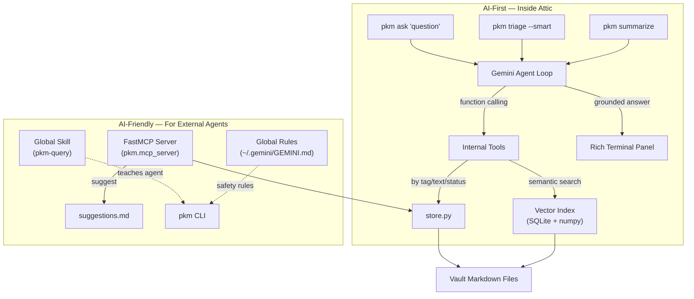

# Attic

**A grounded, friction-free personal action and knowledge workspace.**  
Operates natively in your terminal via the `pkm` command.

Attic is designed for focus, speed, and cognitive clarity—combining an ADHD-friendly flat-markdown workflow with modern **AI-First** internal intelligence and **AI-Friendly** agent integrations.

---

## Highlights & Philosophy

- ⚡ **Sub-2-second capture**: Dump thoughts directly from CLI or clipboard without context switching (`in "thought"`, `inclip`).
- 🛑 **Hard WIP limits**: Enforces active focus (`In Flight <= 5`) to prevent cognitive overload.
- 📂 **Flat Markdown truth**: No proprietary databases, no YAML frontmatter clutter. Every note is plain, human-readable Markdown.
- 🛡️ **Defensive atomic mutations**: Every file write uses `.tmp` files + `os.replace` + automatic `.bak` backups with one-command recovery (`pkm undo`).
- 🤖 **AI-First built-in**: Embedded Gemini autonomous agent loop (`pkm ask`), vectorized SQLite + NumPy semantic search (`pkm relate`, `pkm index`), and AI-powered triage (`pkm triage --smart`).
- 🤝 **AI-Friendly for agents**: Full FastMCP server, global Antigravity/Gemini skills (`pkm-query`), safe suggestion staging (`pkm suggest`), and structured JSON context export (`pkm ctx`).
- 🔄 **Git-backed sync**: Multi-vault background synchronization with automatic OS scheduling (`launchd` on macOS, `crontab` on Linux).
- 📊 **Responsive dashboard**: Side-by-side terminal dashboard with celebratory dopamine feedback (`pkm dash`).

---

## Vault Architecture

Each vault is a standalone directory composed of plain Markdown files:

```
<vault_directory>/
├── active.md          # 3-tier focus file: In Flight, Waiting / Blocked, Scratchpad
├── inbox.md           # Append-only landing pad for fast timestamped captures
├── log.md             # Archival audit trail of completed and discarded items
├── someday.md         # Cold-storage archive for inbox bankruptcies
├── suggestions.md     # Staging ground for AI task proposals
└── projects/          # Dedicated long-form project notes
    ├── auth.md
    └── infra.md
```

### Inline Metadata Format (No YAML Frontmatter)
- **Inbox Items**: `- YYYY-MM-DD HH:MM [tag]: note text (optional url)`
- **Active Focus**: 
  - `## In Flight`: `- [ ] Task text [tag]`
  - `## Waiting / Blocked`: `- Blocker or dependency [tag]`
  - `## Scratchpad`: `- Ephemeral notes and scratch items`
- **Audit Logs**: `- <disposition> [YYYY-MM-DD HH:MM]: text` (dispositions: `completed`, `dropped`, `not-actionable`)
- **Projects**: Scaffolded with Context, Decisions, Links, and Notes sections.

---

## AI Capabilities

Attic operates on two complementary AI axes:



### 1. AI-First: Intelligence Inside Attic
- **Agentic Q&A (`pkm ask "<question>"`)**: Gemini uses an autonomous tool loop with 8 internal query functions (`search_by_tag`, `search_text`, `get_active_items`, `get_inbox_items`, `get_log_entries`, `get_project_note`, `list_all_tags`, `semantic_search`) to retrieve real notes before synthesizing answers with citations.
- **SQLite + NumPy Vector Index (`pkm index`)**: Chunks notes into float32 vectors in `~/.cache/pkm/embeddings.db`. Features incremental mtime detection (only modified files are re-embedded) and vectorized NumPy dot products for sub-millisecond retrieval.
- **Related Notes (`pkm relate "<concept>"`)**: Conceptual similarity search uncovering connections across your vaults.
- **Smart Triage (`pkm triage --smart`)**: Evaluates inbox captures against WIP limits and suggests actions (`PROMOTE`, `WAITING`, `ARCHIVE`, `DROP`) with options to apply all or stage to `suggestions.md`.
- **Note Summaries (`pkm summarize [--period day|week|month]`)**: Structured narrative summaries of accomplishments from your completion log.

### 2. AI-Friendly: For External Agents (Antigravity, Cursor, etc.)
- **FastMCP Server**: Exposes 10 read tools, a safe `suggest` staging tool, and config-gated direct write tools. Run via `python -m pkm.mcp_server`.
- **Suggestion Staging Pattern**: Agents stage proposals in `suggestions.md` instead of mutating files unapproved. You review proposals interactively using `pkm review-suggestions`.
- **Global Skill & Rules**: `pkm setup agent-tools` installs the `pkm-query` skill globally to `~/.gemini/config/skills/pkm-query/` and appends safety rules to `~/.gemini/GEMINI.md`.
- **Programmatic Context Dumps (`pkm ctx --format json --stats --include-projects`)**: Emits structured JSON for agent consumption.

---

## Installation & Setup

### Prerequisites
- Python 3.11+
- [`uv`](https://docs.astral.sh/uv/)
- [`fzf`](https://github.com/junegunn/fzf) (for interactive fuzzy pickers)
- `git`
- Recommended: [`rg`](https://github.com/BurntSushi/ripgrep), [`bat`](https://github.com/sharkdp/bat)

### Install
Clone and install with `uv`:
```bash
git clone git@github.com:Safikh/attic.git ~/dev/pkm
cd ~/dev/pkm
uv sync
```

Run interactive setup:
```bash
uv run pkm setup
```

### Enable Shell Shortcuts
Add thin shell aliases to your `~/.zshrc` or `~/.bashrc`:
```bash
source ~/dev/pkm/shell/pkm.zsh
```
Aliases available:
- `in "text"`: Fast capture to inbox
- `win "text"`: Fast capture to work vault (`-v w`)
- `inclip` / `winclip`: Capture system clipboard
- `act "task"`: Add directly to active focus (`In Flight`)
- `wact "task"`: Add directly to work focus

### Configure AI Features
Set your Gemini API key in your environment:
```bash
export GEMINI_API_KEY="your-api-key"
```
Or configure it in `~/.config/pkm/config.toml`:
```toml
[ai]
provider = "gemini"
model = "gemini-2.5-flash"
embed_model = "text-embedding-004"
api_key = "your-api-key"
```

### Configure AI Agent Tools Machine-Wide
To enable external AI agents across any repository on your machine to interact with Attic:
```bash
uv run pkm setup agent-tools
```
This automatically registers the FastMCP server, installs the global `pkm-query` skill, and adds safety rules to `~/.gemini/GEMINI.md`.

---

## CLI Command Reference

### Capture & Active Focus
| Command | Description |
|---|---|
| `pkm capture [TEXT...] [-t TAG] [--clip] [--url]` | Capture thought to `inbox.md`. Opens `$EDITOR` if empty. |
| `pkm act [TEXT...] [-a/-b/-s]` | Add directly to `active.md` (Flight, Waiting, or Scratchpad). |
| `pkm next` | Print the #1 In Flight item from the default vault. |
| `pkm top` | Print the top In Flight item from every configured vault. |
| `pkm count` | Display current In Flight count against the WIP cap. |

### Triage & Task Movement
| Command | Description |
|---|---|
| `pkm move` | Interactive 2-step triage (`fzf` multi-select items -> destination). |
| `pkm promote` | Multi-select inbox items -> `In Flight`. |
| `pkm done` | Multi-select In Flight items -> `log.md` (marked completed). |
| `pkm drop` | Multi-select active items -> `log.md` (marked dropped). |
| `pkm block` / `unblock` | Move items between `In Flight` and `Waiting / Blocked`. |
| `pkm bankrupt` | Archive entire inbox into `someday.md` under a datestamped header. |

### AI & Knowledge Queries
| Command | Description |
|---|---|
| `pkm ask "<question>"` | Agentic multi-tool query loop answering questions with citations. |
| `pkm index [--rebuild]` | Incrementally index vault notes into the SQLite vector database. |
| `pkm relate "<text>"` | Surface semantically similar notes with similarity percentages. |
| `pkm summarize [-p day\|week\|month]` | AI narrative synthesis of completed work from `log.md`. |
| `pkm triage [--smart]` | AI-assisted inbox triage evaluating items against WIP limits. |
| `pkm suggest "text" [-a ACTION] [-r REASON]` | Stage an AI task suggestion in `suggestions.md`. |
| `pkm review-suggestions` | Interactively accept/reject staged AI suggestions. |
| `pkm ctx [TAG] [--auto] [--format json] [--stats]` | Export context for LLMs (supports text or structured JSON). |

### Dashboard & Analytics
| Command | Description |
|---|---|
| `pkm dash [--full] [--greeting]` | Side-by-side terminal dashboard with dopamine accomplishments footer. |
| `pkm today` | Active focus items alongside items completed today. |
| `pkm week` | Count items completed in the past 7 days. |
| `pkm stale [DAYS]` | List inbox items older than N days (default 7). |
| `pkm project [NAME] [--items]` | View project notes or list all items tagged with a project. |
| `pkm search` | Interactive fuzzy search across all vault markdown notes (`rg` + `fzf` + `bat`). |
| `pkm random` | Surface a random serendipitous item from inbox. |

### Safety & Administration
| Command | Description |
|---|---|
| `pkm sync [--install\|--uninstall\|--status]` | Sync vaults with Git remotes; installs background OS scheduler. |
| `pkm undo` | Restore `.bak` files created during the most recent operation. |
| `pkm doctor` | Diagnostics table checking tools, vaults, config, and sync daemon. |
| `pkm setup agent-tools` | Register MCP server, global skills, and rules for AI agents. |

---

## Configuration (`~/.config/pkm/config.toml`)

```toml
[settings]
default_vault = "personal"
wip_cap = 5
greeting_cooldown_hours = 2

[vaults.personal]
path = "/Users/you/notes/personal"
alias = "p"
remote = "git@github.com:you/notes-personal.git"

[vaults.work]
path = "/Users/you/notes/work"
alias = "w"
remote = "git@github.com:you/notes-work.git"

[sync]
enabled = true
interval_minutes = 30

[mcp]
allow_direct_writes = false  # Agents must use 'suggest' staging unless set to true

[ai]
provider = "gemini"
model = "gemini-2.5-flash"
embed_model = "text-embedding-004"
# api_key = "..." # Optional: defaults to GEMINI_API_KEY env var
```

---

## Testing

Run the full automated test suite (19 tests):
```bash
uv run pytest tests/ -v
```

---

## License

MIT
